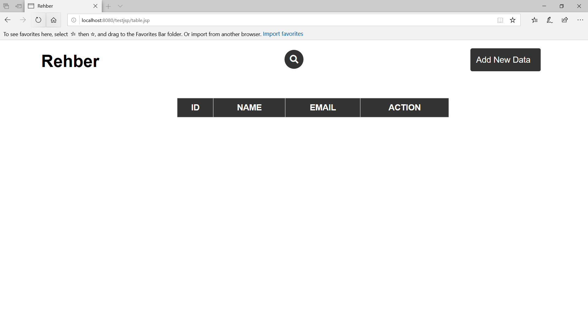
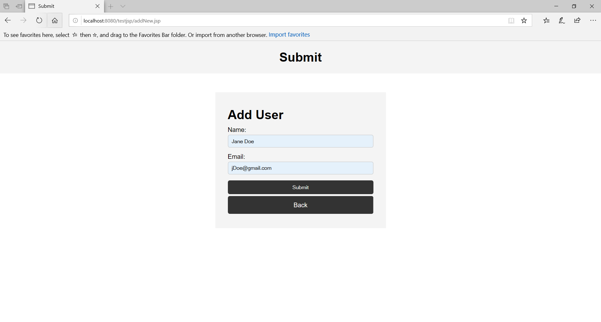
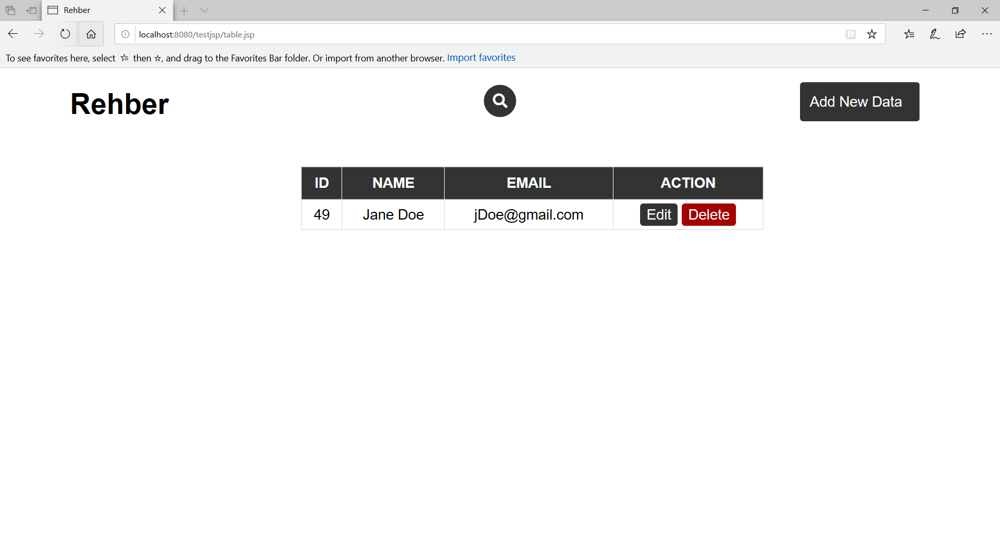
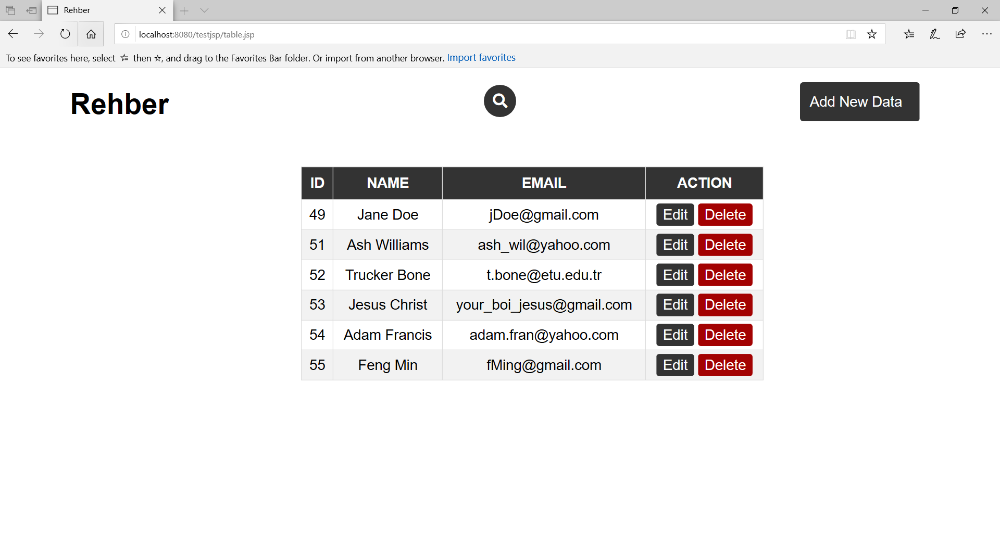
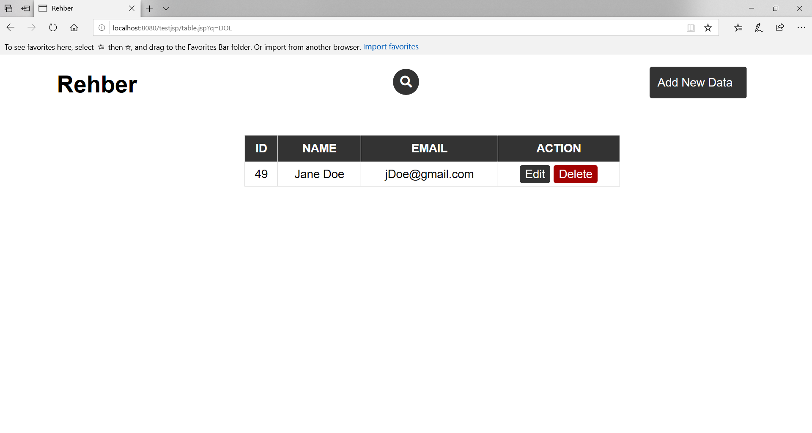
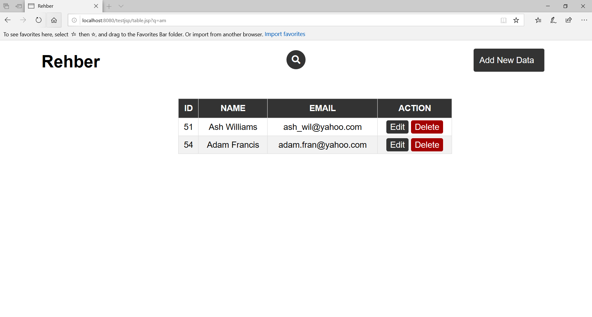
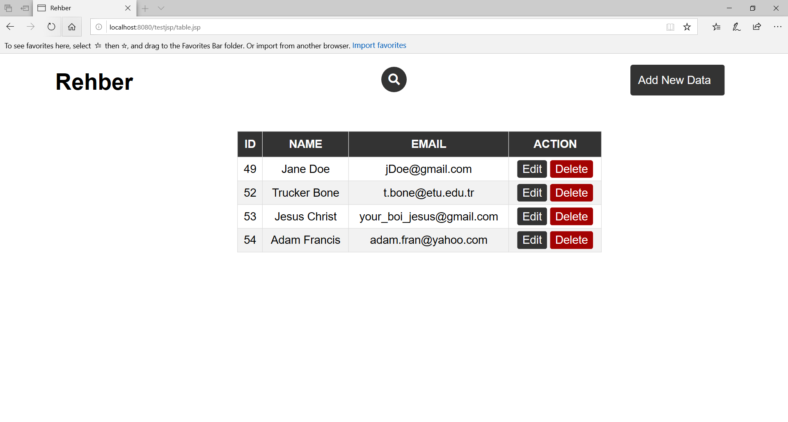

# Crud-jsp

This is a Create-Read-Update-Delete based program that uses jsp. It is connected to a database named "idk" and will operate on a table named "smth".
The file table.jsp shows the database table 

## This is how it works;

 **table.jsp file is showing the database without any data**
  
   
  
  
  **After clicking Add New Data, it will transfer you to a new page to add new data**
  
   
  
  **After adding the data "Jane Doe" addNew.jsp file will tranfer you to table.jsp**
  
   
  
  **Add a few more data**
  
   
  
  **Searched "Doe" to find Jane Doe in the table**
  
   
  
  **Searched "am" to find words that has "am" in it**
  
   
  
  **Delete Ash Williams**
  
   
  
   
  
  **Edit Adam Francis's name to Adam Francisco**
  
   

